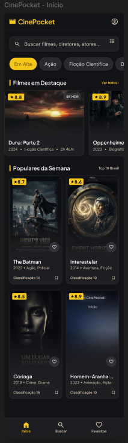
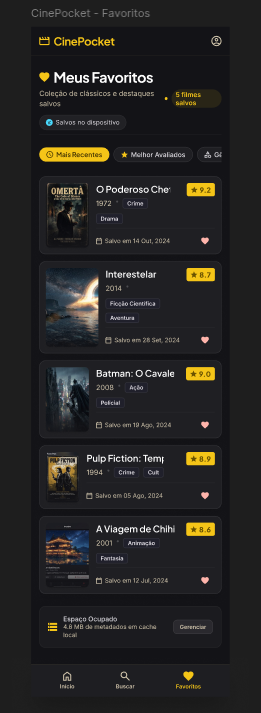

# CinePocket

## Sobre o projeto

O **CinePocket** é um aplicativo mobile para quem gosta de cinema. A proposta é
oferecer uma experiência inspirada em plataformas como o IMDb, permitindo
descobrir filmes, consultar informações sobre cada título e registrar opiniões
de forma simples e prática.

Com o aplicativo, o usuário pode encontrar filmes por meio da busca, conhecer
detalhes como sinopse, gênero e nota, salvar títulos favoritos e organizar
melhor o que deseja assistir. A interface foi pensada para tornar a descoberta
de novos filmes rápida e agradável, diretamente pelo celular.

## Principais funcionalidades

- Explorar filmes em destaque e recomendações;
- Buscar filmes pelo título;
- Visualizar detalhes, sinopse, gênero e avaliação;
- Classificar filmes de acordo com a opinião do usuário;
- Adicionar e consultar filmes favoritos;
- Acessar e personalizar as configurações do aplicativo.

## Objetivo

O objetivo do CinePocket é centralizar a descoberta e a avaliação de filmes em
um único aplicativo, criando um espaço pessoal para acompanhar títulos,
compartilhar opiniões e decidir o que assistir em seguida.

## Tecnologias

- Flutter;
- Dart;
- Android, iOS, Web, Windows, macOS e Linux.

## Layout da aplicação

> Adicione abaixo as imagens do layout final do aplicativo.

### Tela inicial

### Busca e detalhes do filme

### Favoritos e avaliações

## Protótipo no Figma

Confira o protótipo e o design das telas no Figma:

[Acessar o projeto no Figma](COLE_AQUI_O_LINK_DO_FIGMA)
