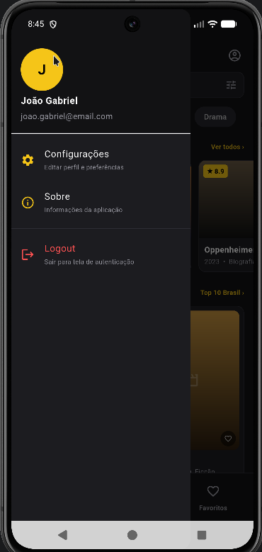
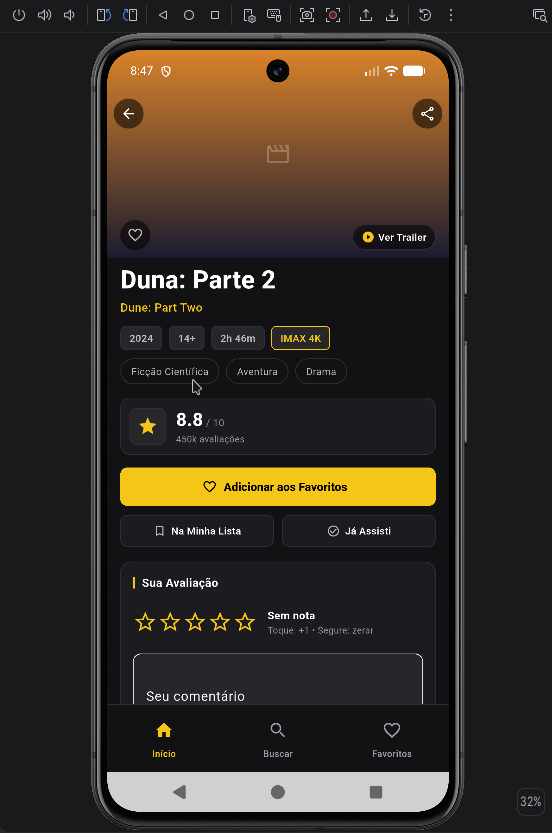
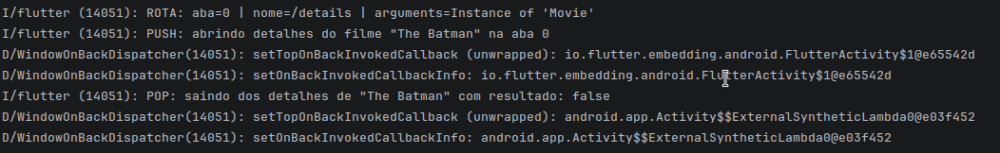

# Registro da implementação de navegação

## Evidências da aplicação

### 1. Drawer aberto

Adicione um print mostrando o Drawer aberto com as opções de configurações,
sobre e logout.

### 2. Empilhamento de rotas em uma aba

Adicione um print mostrando a navegação da tela principal de uma aba para uma
tela de detalhes e o retorno usando o histórico local da aba.

### 3. Logs de push e pop

Adicione um print do console ou terminal com os logs que comprovem as
operações de navegação (`push`, `pop` e, quando aplicável, `pushReplacement`).

## Demonstração em vídeo

Adicione um vídeo mostrando o Drawer, a troca entre abas, a abertura de uma
rota interna e o retorno pelo botão voltar:

[Assistir ao vídeo da navegação](./video-implementacao-navegacao.mp4)

## Justificativa das decisões

Foram utilizados três `Navigator`s aninhados, um para cada seção principal:
Início, Buscar e Favoritos. O `IndexedStack` mantém esses navegadores montados
ao alternar a aba, preservando tanto o estado visual quanto o histórico de
rotas de cada seção. Essa decisão é aplicada em
[`MainShell`](../../lib/main.dart#L40-L61) e no
[`IndexedStack`](../../lib/main.dart#L220-L227). A barra inferior usa o
`NavigationBar` do Material 3 para trocar entre as três abas
([`NavigationBar`](../../lib/main.dart#L228-L253)).

O Drawer foi escolhido para ações globais e complementares. Configurações usa
`push`, pois abre uma tela temporária sobre o fluxo atual e pode retornar um
novo nome com `Navigator.pop` e valor. Sobre usa um `AlertDialog`, sem criar
uma tela permanente. Logout usa `pushReplacementNamed`, pois substitui a rota
principal e impede que o usuário volte para a área autenticada pelo botão
voltar. Essas decisões estão em
[`_buildDrawer`](../../lib/main.dart#L68-L181).

As rotas principais são centralizadas no `MaterialApp` em
[`CinePocketApp`](../../lib/main.dart#L13-L35), enquanto as rotas internas das
abas são geradas por [`TabRoutes.generate`](../../lib/navigation/tab_routes.dart#L12-L39).
A tela de detalhes recebe um filme por `arguments`, e devolve um resultado
booleano ao fazer `Navigator.pop`; esse fluxo está em
[`openMovieDetails`](../../lib/navigation/route_names.dart#L19-L36).

A principal dificuldade técnica foi coordenar o Drawer externo, os três
`Navigator`s internos e o botão voltar do sistema. A solução foi manter uma
`GlobalKey<NavigatorState>` por aba e tratar o retorno em etapas: fechar o
Drawer, fazer `pop` na pilha da aba ativa, voltar para a aba Início ou sair do
aplicativo. Essa lógica está em
[`PopScope`](../../lib/main.dart#L184-L219), garantindo que cada ação respeite
o histórico local correto.