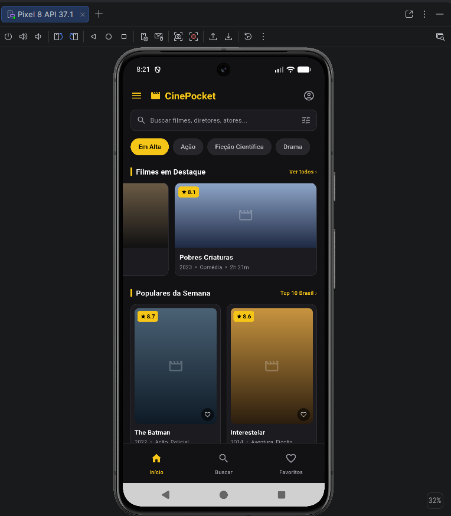

# Registro da implementação da tela

## Screenshot da tela implementada

Adicione abaixo o screenshot da tela final:

## Justificativa do layout

A tela implementada é a página inicial do CinePocket, organizada em três áreas
visuais principais: busca e categorias, filmes em destaque e filmes populares.
No modo mobile, essas áreas são apresentadas verticalmente em uma lista rolável,
conforme a implementação de [`MobileLayout`](../../lib/screens/home_screen.dart#L36-L67).

No modo tablet/desktop, a estrutura utiliza [`Column`](../../lib/screens/home_screen.dart#L84)
para organizar o conteúdo verticalmente e [`Row`](../../lib/screens/home_screen.dart#L88-L98)
para posicionar a busca, as categorias e as duas colunas de filmes lado a lado.
Os widgets [`Expanded`](../../lib/screens/home_screen.dart#L90-L91) distribuem
o espaço disponível sem fixar a interface a uma largura específica, tanto na
linha de busca e categorias quanto nas duas colunas de conteúdo.

Os espaçamentos e recuos são controlados principalmente por [`Padding`](../../lib/screens/home_screen.dart#L82-L84)
e [`SizedBox`](../../lib/screens/home_screen.dart#L91-L95), evitando o uso
desnecessário de `Container` apenas para posicionamento.

## Responsividade

A responsividade é aplicada em [`LayoutBuilder`](../../lib/screens/home_screen.dart#L24-L31):
quando a largura é menor que `600`, a tela usa o layout mobile; em larguras
maiores, usa o layout para tablet/desktop. Além disso, [`MediaQuery`](../../lib/screens/home_screen.dart#L79-L80)
define três ou quatro colunas no grid de filmes conforme a largura disponível.

## Referências dos widgets exigidos

- `Column`: [`home_screen.dart:84`](../../lib/screens/home_screen.dart#L84)
- `Row`: [`home_screen.dart:88`](../../lib/screens/home_screen.dart#L88)
- `Expanded`: [`home_screen.dart:90`](../../lib/screens/home_screen.dart#L90)
- `Padding`: [`home_screen.dart:82`](../../lib/screens/home_screen.dart#L82)
- `SizedBox`: [`home_screen.dart:91`](../../lib/screens/home_screen.dart#L91)
- `LayoutBuilder`: [`home_screen.dart:24`](../../lib/screens/home_screen.dart#L24)