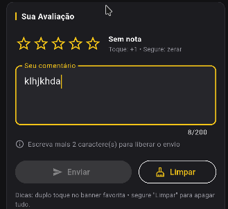
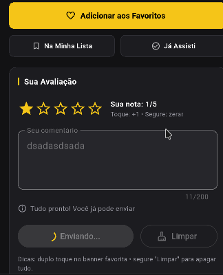
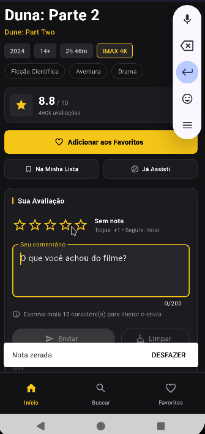

# Registro do tratamento de eventos

## Evidências da aplicação

Adicione de 2 a 3 screenshots mostrando as interações realizadas na tela de
detalhes do filme.

### 1. Interação com o campo de texto

Mostre o campo de comentário com o texto sendo digitado, o contador de
caracteres e a validação visual da condição para envio.

### 2. Execução de um botão

Mostre a ação do botão **Enviar** ou **Limpar**, incluindo o feedback exibido
pela aplicação.

### 3. Uso de gesto

Mostre a interação com as estrelas usando toque ou toque prolongado.

## Registro em vídeo

Adicione abaixo um vídeo curto demonstrando a sequência de interações:

[Assistir ao vídeo da interação](./video-tratamento-eventos.mp4)

## Eventos implementados

- **`TextField.onChanged`**: o campo de comentário reage a cada alteração,
  registra o valor digitado com `debugPrint` e atualiza a interface em tempo
  real. A implementação está em
  [`_onTextChanged`](../../lib/screens/movie_details_screen.dart#L105-L109) e
  no [`TextField`](../../lib/screens/movie_details_screen.dart#L570-L588).
- **`onPressed` do botão Enviar**: o envio só fica disponível quando o texto
  possui pelo menos 10 caracteres e existe uma nota. O botão desabilitado e a
  condição são definidos em
  [`_canSubmit`](../../lib/screens/movie_details_screen.dart#L43-L45) e
  [`FilledButton`](../../lib/screens/movie_details_screen.dart#L602-L616).
- **`onPressed` do botão Limpar**: limpa o comentário e a nota, oferecendo uma
  ação de desfazer pelo `SnackBar`. Esse comportamento está em
  [`_clear`](../../lib/screens/movie_details_screen.dart#L164-L188) e no
  [`OutlinedButton`](../../lib/screens/movie_details_screen.dart#L618-L625).
- **`onTap` e `onLongPress` nas estrelas**: um toque aumenta a nota de forma
  cíclica; um toque prolongado zera a nota e oferece a opção de desfazer. Os
  eventos estão no [`InkWell`](../../lib/screens/movie_details_screen.dart#L529-L544),
  com processamento em [`_onStarsTap`](../../lib/screens/movie_details_screen.dart#L79-L85)
  e [`_onStarsLongPress`](../../lib/screens/movie_details_screen.dart#L87-L102).
- **Feedback**: mensagens são exibidas com `SnackBar`, enquanto confirmações
  de envio e limpeza total usam `AlertDialog`. O feedback centralizado está em
  [`_showMessage`](../../lib/screens/movie_details_screen.dart#L53-L65).

## Encadeamento de eventos

O botão **Enviar** segue a sequência:

1. Verifica se o comentário e a nota atendem às condições mínimas;
2. Abre um `AlertDialog` para confirmação;
3. Simula o processamento do envio;
4. Limpa o formulário;
5. Exibe um `SnackBar` de sucesso;
6. Adiciona automaticamente o filme aos favoritos quando a nota é 4 ou 5.

Esse encadeamento está implementado em
[`_submit`](../../lib/screens/movie_details_screen.dart#L112-L162). Assim, cada
ação gera um próximo comportamento previsível e o usuário recebe confirmação
antes e depois do processamento.

## Decisão de experiência do usuário

Foi utilizada uma validação em tempo real para explicar por que o envio está
bloqueado, em vez de permitir o toque e exibir um erro somente depois. O
feedback aparece no próprio formulário e o botão permanece desabilitado até que
as condições sejam satisfeitas. Durante o envio, `_submitting` bloqueia novas
entradas, evitando duplo envio e estados inconsistentes; essa regra está
descrita em [`_submitting`](../../lib/screens/movie_details_screen.dart#L34-L38).

Além disso, o método [`_showMessage`](../../lib/screens/movie_details_screen.dart#L53-L65)
oculta o `SnackBar` anterior antes de mostrar o novo. Dessa forma, eventos
rápidos ou simultâneos não acumulam mensagens na tela e o usuário vê sempre o
feedback mais recente.